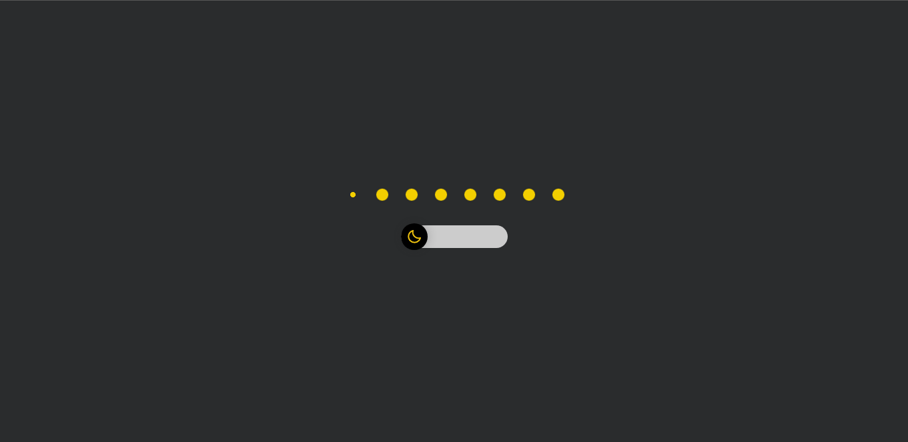
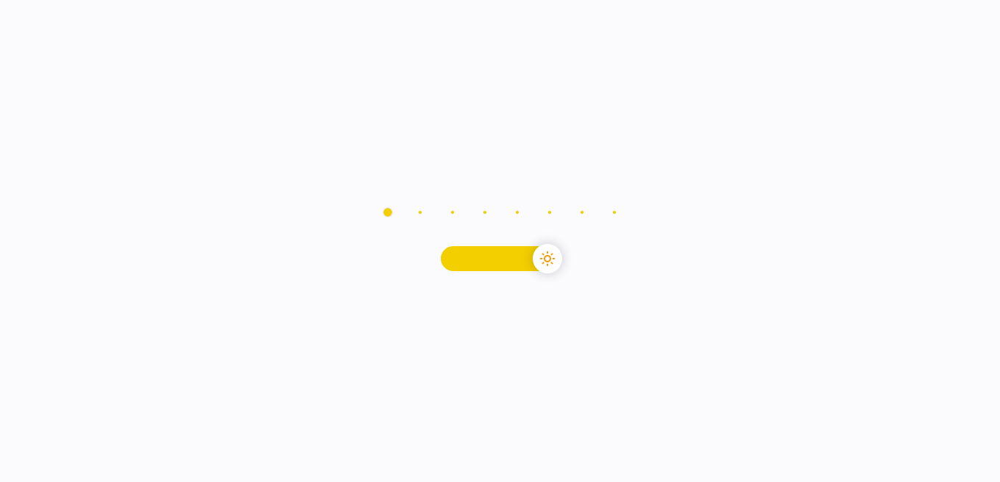

<H1 align="center"></H1>

 

    
    

<a href="#sobre-o-projeto">Sobre o Projeto</a>&nbsp;&nbsp;|&nbsp;&nbsp;
<a href="#tecnologias">Tecnologias</a>&nbsp;&nbsp;|&nbsp;&nbsp;
<a href="#licença">Licença</a>

 

##  Sobre o Projeto
Theme Switcher é uma pagina que contem um botão que ao ser acionado altera o tema da pagina entre dark e light.
  

  

  

## Tecnologias

- [HTML 5](https://www.w3schools.com/html/)
- [CSS 3](https://developer.mozilla.org/pt-BR/docs/Web/CSS)
- [Javascript](https://developer.mozilla.org/pt-BR/docs/Web/JavaScript)

## Licença

 
Esse projeto está sob a licença MIT. Veja o arquivo <a href="https://opensource.org/licenses/MIT">LICENSE</a> para mais detalhes.
 
